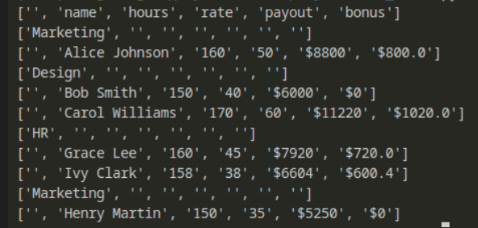

# just-python-code

Это консольное приложение для генерации различных видов отчётов по сотрудникам из CSV-файлов.

скрипт, который читает данные из файлов в формате csv
используются 2 функции для чтения и записи в файлы — src/csv_tools.py
write_csv, read_csv  без использования стандартной библиотеки csv 

формирует простой отчет по зарплате
используется набор функций:

в prepare_data.py собираются данные в один стиль
переименовываются колонки, так как в разных csv могут быть разные названия типа hourly_rate, rate, salary
для этого есть вспомогательная функция search_hourly_rate

на выходе из каждого csv получается одинаковая структура: ['id', 'email', 'name', 'department', 'hours_worked', 'hourly_rate']

потом создается файл отчёт
в функции create_report задается общая структура отчёта — типа скелет для дальнейших изменений
пример структуры:
['', 'name', 'hours', 'rate']
['type', '', '', '']

дальше:

add_payout — считает зарплату (часы * ставка)
add_bonus — добавляет бонус (если отработано больше 150 часов, +10% к зарплате)

есть функция generate_report
она принимает название типа отчёта
и отдает нужный отчёт для передачи дальше в main

это основная точка входа в проект здесь:
собираются все аргументы из консоли
читаются csv файлы
подготавливаются данные
генерируется нужный отчёт
выводится в консоль или пишется в файл

argparse — библиотека для парсинга аргументов из командной строки
настраиваем параметры:

files — можно передать один или несколько csv файлов

--report — какой тип отчёта нужен (report, payout, bonus)
--save — если указать эту галочку, результат сохранится в файл

<h1 align="center">just-python-code</h1>

<h2 align="center">Используемые библиотеки</h2>

<div align="center">

<a href="https://www.python.org" target="_blank" rel="noreferrer" style="display: inline-block;"> 
  
</a>

<a href="pytest" target="pytest" rel="noreferrer"> 
     
</a>

</div>


### 1. Клонируй проект и перейди в папку
```bash
git clone git@github.com:TUBE-GULL/just-python-code.git

cd just-python-code
```

## 2. Установка Зависимостей 

```bash
pip install pytest 

```
## или Установить с помощью файла `requirements.txt` 
```bash
pip install -r requirements.txt

```

## 3. Запуск 
```bash
python src/main.py ./downloads/data1.csv ./downloads/data2.csv --report report
python src/main.py ./downloads/data1.csv ./downloads/data2.csv --report payout 
python src/main.py ./downloads/data1.csv ./downloads/data2.csv --report bonus
```





### 3. Тестирование
```bash
pytest
```


